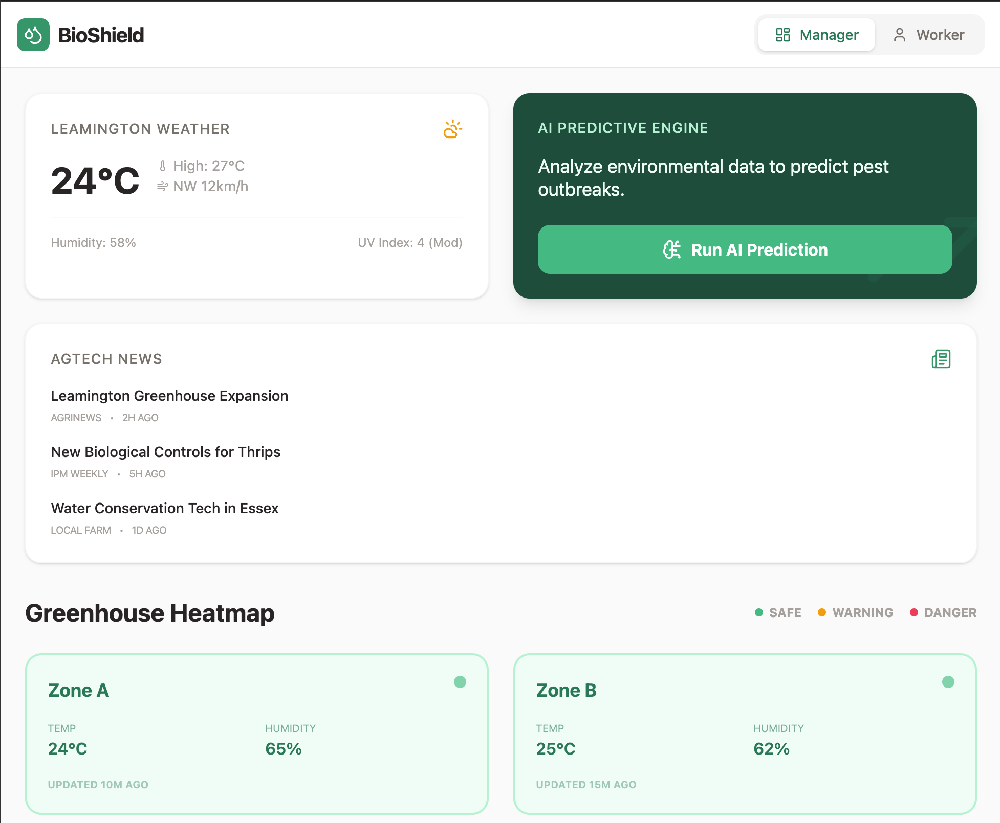

# BioShield: Predictive Integrated Pest Management (IPM)

*(Click the image above to watch our 90-second pitch and UI demo!)*

## 🌿 Overview
**BioShield** is an intelligence layer for modern greenhouses designed to eliminate the 10-20% yield loss caused by pests and disease. Developed as part of the **Agri-food Innovation Challenge**, BioShield bridges the gap between high-level climate data and ground-level execution.

---

## 🛑 The Problem
In Leamington, Ontario—the greenhouse capital of North America—farmers face two critical bottlenecks:
1. **Reactive Scouting:** By the time human eyes spot an infestation, it’s often too late, leading to tons of defective produce clogging local landfills.
2. **Language Barriers:** With over 65% of the workforce facing language barriers, complex pest management instructions are frequently lost in translation, resulting in improper treatment or missed hotspots.

## 💡 The Solution
BioShield solves these issues through a dual-interface platform:

### 1. Manager Predictive Dashboard
Our AI engine ingests real-time climate data (temperature, humidity, light) to forecast pest hotspots *before* they emerge. Managers can visualize risk levels across greenhouse zones using a dynamic heatmap and dispatch tasks with a single click.

### 2. Worker "Icon-Driven" Dispatch
We replace complex manuals with a strictly visual, language-agnostic interface. Tasks are sent directly to workers' phones as simple, high-contrast icons:
- **The Location:** (e.g., Zone C, Row 12)
- **The Threat:** (e.g., Spider Mite icon)
- **The Action:** (e.g., Spray Bottle or Scissors icon)

---

## 🚀 Key Features
- **Gemini-Powered Predictions:** Uses advanced AI to correlate environmental shifts with pest life cycles.
- **Language-Agnostic UI:** Zero English required for field execution, empowering a diverse workforce.
- **Zero New Hardware:** A Progressive Web App (PWA) that works on existing smartphones, even in Wi-Fi "dead zones."
- **Audit-Ready Reporting:** Automatically generates digital disease-tracing logs for compliance and sustainability audits.

---

## 🛠️ Tech Stack
- **Frontend:** React, Tailwind CSS, Lucide Icons, Motion (Framer Motion)
- **AI Engine:** Google Gemini API
- **Climate Data:** OpenWeatherMap API (Mocked)
- **Deployment:** Cloud Run / PWA

---

## 📂 Backend Demos & Integration
To support scalability and integration with existing farm infrastructure, we have included several backend demonstration files:

- **`backend-demos/firebase_python_demo.py`**: A Python script demonstrating how to connect to the BioShield Firestore database. This is ideal for data science teams or remote sensor integrations.
- **`backend-demos/sql_node_demo.ts`**: A Node.js script showing how to manage greenhouse data using a relational SQL database (SQLite), perfect for local data persistence.
- **`backend-demos/schema.sql`**: A complete SQL schema definition for managing zones, tasks, and historical pest data for future AI training.

---

## 👥 The Team
Developed with passion for the **Agri-food Innovation Challenge**.

1. **[Prabhsharan Singh Sethi](https://github.com/your-github)** - [Lead Developer & Video Production]
2. **[Jamie Tan](https://github.com/your-github)** - [Quality Assurance (QA) & Product Review]
3. **[Ashley Zhu](https://github.com/your-github)** - [Physical Showcase Design (Trifold) & Pitch Strategy]
4. **[Gurleen Kaur](https://github.com/your-github)** - [Presentation Coordination & UI Feedback]

---
*BioShield: Predictive, Zero-Waste farming is ready now.*
